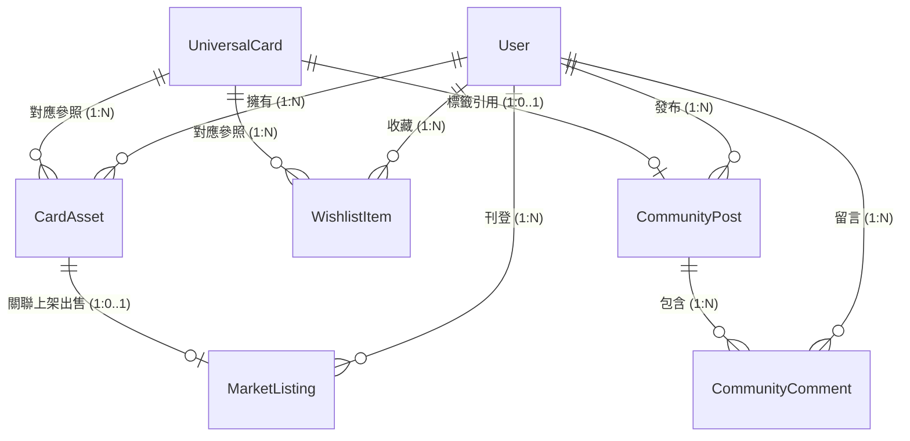
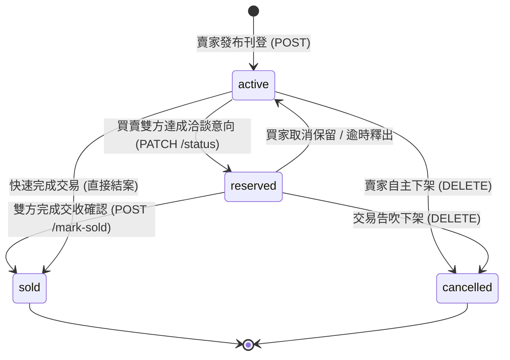

# MCARD 系統技術規格文件 (System & API Specification)

- **版本**：1.0.0
- **狀態**：正式生效 (Active)
- **架構**：RESTful API v1 / Local-First 轉向 BaaS (PostgreSQL / Supabase)
- **基礎資料基準**：貨幣預設儲存為 USD；時間格式均為 ISO-8601 UTC

---

## 1. 核心資料模型 (Core Data Models)

### 1.1 實體定義 (Entity Definitions)

#### 1.1.1 用戶實體 (User)
記錄系統用戶、藏家身分與認證資料。
| 欄位名稱 | 型別 | 必填 | 預設值 | 說明 |
| :--- | :--- | :---: | :---: | :--- |
| `id` | `string (UUID)` | 是 | 自動生成 | 用戶唯一識別碼 |
| `name` | `string` | 是 | - | 用戶暱稱 / 顯示名稱 (最長 50 字元) |
| `email` | `string` | 是 | - | 註冊電子郵件 (唯一值) |
| `avatarUrl` | `string (URL)` | 是 | - | 頭像圖片連結 |
| `provider` | `'google' \| 'email'` | 是 | `'email'` | 登入身分提供商 |
| `badge` | `string` | 否 | `null` | 稱號/榮譽標籤 (如 `'Master Collector'`) |
| `joinedAt` | `string (ISO-8601)` | 是 | 當前時間 | 註冊加入時間 |

---

#### 1.1.2 跨領域卡牌基礎實體 (UniversalCard)
由系統維護的卡牌圖鑑庫（涵蓋 Pokémon、One Piece、Yu-Gi-Oh!、Dragon Ball、NBA、FIFA）。
| 欄位名稱 | 型別 | 必填 | 預設值 | 說明 |
| :--- | :--- | :---: | :---: | :--- |
| `id` | `string` | 是 | - | 卡牌全域唯一識別碼 (如 `'sv3pt5-199'`) |
| `name` | `string` | 是 | - | 卡牌官方名稱 (如 `'Charizard ex'`) |
| `category` | `'pokemon' \| 'yugioh' \| 'onepiece' \| 'dragonball' \| 'nba' \| 'fifa'` | 是 | - | 卡牌所屬領域種類 |
| `number` | `string` | 是 | - | 卡牌編號 (如 `'199/165'`) |
| `set` | `string` | 是 | - | 所屬系列/擴充包名稱 (如 `'151'`) |
| `rarity` | `string` | 是 | - | 稀有度標籤 (如 `'Special Illustration Rare'`) |
| `type` | `string` | 是 | - | 屬性/位置 (如 `'Fire'`, `'Forward'`) |
| `price` | `number` | 是 | `0` | 當前市場官方參考行情 (USD) |
| `imageUrl` | `string (URL)` | 是 | - | 卡牌高清正面大圖 |
| `artistOrPlayer`| `string` | 否 | `null` | 繪師名稱或球星姓名 |
| `releaseYear` | `number \| string` | 否 | `null` | 發售年份 (如 `2023`) |
| `tcgplayerUrl` | `string (URL)` | 否 | `null` | 權威交易平台外鏈 |
| `description` | `string` | 否 | `null` | 卡牌招式描述或球員生平簡介 |

---

#### 1.1.3 個人持倉資產 (CardAsset)
記錄用戶實際擁有並管理的個人卡牌資產與損益帳本。
| 欄位名稱 | 型別 | 必填 | 預設值 | 說明 |
| :--- | :--- | :---: | :---: | :--- |
| `id` | `string (UUID)` | 是 | 自動生成 | 資產記錄唯一碼 |
| `userId` | `string (UUID)` | 是 | - | 擁有者 User ID |
| `cardId` | `string` | 是 | - | 對應之 UniversalCard ID |
| `name` | `string` | 是 | - | 卡牌名稱快照 (避免外部更名失真) |
| `category` | `CardCategory` | 是 | - | 卡牌種類快照 |
| `price` | `number` | 是 | `0` | 最新市場行情單價 (USD) |
| `buyPrice` | `number` | 是 | `0` | 實際購入成本單價 (USD) |
| `quantity` | `number (Integer)` | 是 | `1` | 持有張數 (必須 $\ge 1$) |
| `condition` | `'Ungraded' \| 'PSA 10' \| 'PSA 9' \| 'BGS 10' \| 'BGS Black Label'` | 是 | `'Ungraded'` | 鑑定評級或卡況品相 |
| `imageUrl` | `string (URL)` | 是 | - | 卡牌圖片快照 |
| `addedAt` | `string (ISO-8601)` | 是 | 當前時間 | 入庫記錄時間 |

---

#### 1.1.4 心願追蹤卡 (WishlistItem)
用戶加入的心願關注清單與目標價降價預警。
| 欄位名稱 | 型別 | 必填 | 預設值 | 說明 |
| :--- | :--- | :---: | :---: | :--- |
| `id` | `string (UUID)` | 是 | 自動生成 | 心願唯一 ID |
| `userId` | `string (UUID)` | 是 | - | 所屬用戶 ID |
| `cardId` | `string` | 是 | - | 關聯卡牌 ID |
| `cardName` | `string` | 是 | - | 卡牌名稱 |
| `category` | `CardCategory` | 是 | - | 卡牌種類 |
| `setName` | `string` | 是 | - | 系列名稱 |
| `imageUrl` | `string (URL)` | 是 | - | 卡牌圖片 |
| `targetPrice` | `number` | 否 | `null` | 買家期望之「目標入手價」(USD) |
| `baseMarketPrice`| `number` | 是 | - | 加入清單時的基準市場價 (USD) |
| `addedAt` | `string (ISO-8601)` | 是 | 當前時間 | 收藏時間 |
| `notes` | `string` | 否 | `null` | 備註備忘 |

---

#### 1.1.5 二手市集掛單 (MarketListing)
C2C 藏家掛牌出售的商品單。
| 欄位名稱 | 型別 | 必填 | 預設值 | 說明 |
| :--- | :--- | :---: | :---: | :--- |
| `id` | `string (UUID)` | 是 | 自動生成 | 掛單唯一編號 |
| `sellerId` | `string (UUID)` | 是 | - | 賣家 User ID |
| `sellerName` | `string` | 是 | - | 賣家暱稱 |
| `sellerAvatar` | `string (URL)` | 是 | - | 賣家頭像 |
| `sellerRating` | `number` | 否 | `5.0` | 賣家評價分數 (1.0 ~ 5.0) |
| `sellerSalesCount`| `number` | 否 | `0` | 累積成交筆數 |
| `contactPlatform`| `'line' \| 'instagram' \| 'phone' \| 'email'` | 是 | - | 聯絡方式通訊軟體 |
| `contactValue` | `string` | 是 | - | 聯絡帳號或電話 |
| `cardName` | `string` | 是 | - | 卡牌品名 |
| `category` | `CardCategory` | 是 | - | 卡牌種類 |
| `setName` | `string` | 是 | - | 所屬系列 |
| `officialPrice` | `number` | 是 | `0` | 市場官方參考行情 (USD) |
| `askingPrice` | `number` | 是 | - | 賣家開售價格 (USD) |
| `soldPrice` | `number` | 否 | `null` | 最終實際成交金額 (USD) |
| `soldAt` | `string (ISO-8601)` | 否 | `null` | 成交確認時間 |
| `portfolioCardId`| `string (UUID)` | 否 | `null` | 關聯之個人持倉 CardAsset ID |
| `buyInCost` | `number` | 否 | `0` | 當初購入成本 (用於計算成交實際獲利) |
| `condition` | `'PSA 10' \| 'PSA 9' \| 'BGS 9.5' \| 'CGC 10' \| 'Ungraded Near Mint' \| 'Played'` | 是 | - | 品相或評級標籤 |
| `photos` | `string[] (URLs)` | 是 | `[]` | 實體拍攝卡況照片 (1 ~ 5 張) |
| `notes` | `string` | 是 | `""` | 賣家詳細卡況備註/交易說明 |
| `location` | `string` | 是 | - | 出貨地點/交收方式 (如 `'台北面交 / 店到店'`) |
| `createdAt` | `string (ISO-8601)` | 是 | 當前時間 | 刊登發布時間 |
| `status` | `'active' \| 'reserved' \| 'sold'` | 是 | `'active'` | 掛單狀態 |

---

#### 1.1.6 社群動態貼文 (CommunityPost)
玩家社群動態牆貼文。
| 欄位名稱 | 型別 | 必填 | 預設值 | 說明 |
| :--- | :--- | :---: | :---: | :--- |
| `id` | `string (UUID)` | 是 | 自動生成 | 貼文唯一編號 |
| `authorId` | `string (UUID)` | 是 | - | 發布者 User ID |
| `author` | `Object` | 是 | - | 作者快照 `{ id, name, avatar, handle, badge }` |
| `type` | `'showcase' \| 'marketplace' \| 'grading' \| 'discussion'` | 是 | `'showcase'` | 貼文主題分類 |
| `title` | `string` | 是 | - | 貼文標題 (最長 80 字元) |
| `content` | `string` | 是 | - | 貼文正文 (最長 2000 字元) |
| `imageUrl` | `string (URL)` | 是 | - | 首圖 / 主視覺圖片 |
| `additionalImages`| `string[] (URLs)` | 否 | `[]` | 附圖清單 (最多 4 張) |
| `tags` | `string[]` | 否 | `[]` | 話題標籤清單 (如 `["#寶可夢", "#PSA10"]`) |
| `likes` | `number` | 是 | `0` | 累積按讚數 |
| `isLiked` | `boolean` | 否 | `false` | 當前呼叫端用戶是否已按讚 |
| `commentsCount` | `number` | 是 | `0` | 留言總數計數器 |
| `location` | `string` | 否 | `null` | 地理打卡位置 |
| `cardInfo` | `CardTagInfo` | 否 | `null` | 引用卡牌卡片標籤 (品名、價格、品相快照) |
| `createdAt` | `string (ISO-8601)` | 是 | 當前時間 | 貼文發布時間 |

---

#### 1.1.7 社群留言 (CommunityComment)
| 欄位名稱 | 型別 | 必填 | 預設值 | 說明 |
| :--- | :--- | :---: | :---: | :--- |
| `id` | `string (UUID)` | 是 | 自動生成 | 留言唯一識別碼 |
| `postId` | `string (UUID)` | 是 | - | 所屬貼文 ID |
| `authorId` | `string (UUID)` | 是 | - | 留言者 User ID |
| `authorName` | `string` | 是 | - | 留言者名稱 |
| `authorAvatar`| `string (URL)` | 是 | - | 留言者頭像 |
| `content` | `string` | 是 | - | 留言內容文字 (最長 300 字) |
| `createdAt` | `string (ISO-8601)` | 是 | 當前時間 | 留言時間 |
| `likes` | `number` | 否 | `0` | 留言獲讚數 |

---

### 1.2 實體關係 (Entity Relationships)



- **User 與 CardAsset**：1 對多（一個用戶擁有 0 至多張持倉卡）。
- **User 與 MarketListing**：1 對多（一個賣家可上架多筆商品）。
- **CardAsset 與 MarketListing**：1 對 0..1（市集掛單可直接綁定個人持倉；當市集標記售出時，自動更新該 CardAsset 之銷帳扣減）。
- **CommunityPost 與 CommunityComment**：1 對多（刪除貼文時串聯刪除其所有留言）。

---

### 1.3 狀態機 (State Machines)

#### 市集掛單生命週期 (MarketListing Status)



**狀態轉移條件與副作用 (Side Effects)**：
1. `active ➔ sold` 或 `reserved ➔ sold`：
   * 寫入 `soldPrice` 與 `soldAt`。
   * 若該單綁定 `portfolioCardId`，系統自動將持倉庫存 `quantity` 扣減 1，並根據 `soldPrice - buyInCost` 計算並結算該筆「已實現損益（Realized P&L）」。

---

## 2. API 合約 (API Contracts)

### 2.1 認證方式
- **機制**：HTTP Header 攜帶 Bearer Token。
- **標頭格式**：`Authorization: Bearer <JWT_TOKEN>`
- **未授權行為**：存取受保護端點（如新增持倉、發文、刊登市集）時，若 Token 缺失或過期，一律返回 `401 Unauthorized`。

---

### 2.2 主要端點 (Core Endpoints)

#### 2.2.1 投資組合資產 (Portfolio Endpoints)

##### [GET] 取得當前用戶所有持倉清單
- **URL**：`/api/v1/portfolio/assets`
- **權限**：需認證
- **查詢參數**：`category` (選填，如 `pokemon`)
- **200 OK Response 範例**：
```json
{
  "success": true,
  "data": [
    {
      "id": "asset-7f1a8e23",
      "userId": "user-red-01",
      "cardId": "sv3pt5-199",
      "name": "Charizard ex",
      "category": "pokemon",
      "price": 245.0,
      "buyPrice": 180.0,
      "quantity": 1,
      "condition": "PSA 10",
      "imageUrl": "https://images.pokemontcg.io/sv3pt5/199_hires.png",
      "addedAt": "2024-05-15T08:30:00Z"
    }
  ],
  "meta": {
    "totalCount": 1,
    "totalPortfolioValueUSD": 245.0,
    "totalCostUSD": 180.0,
    "totalUnrealizedPnLUSD": 65.0,
    "overallRoiPercent": 36.11
  }
}
```

##### [POST] 新增持倉記錄
- **URL**：`/api/v1/portfolio/assets`
- **權限**：需認證
- **Request Body 範例**：
```json
{
  "cardId": "sv3pt5-199",
  "name": "Charizard ex",
  "category": "pokemon",
  "price": 245.0,
  "buyPrice": 180.0,
  "quantity": 1,
  "condition": "PSA 10",
  "imageUrl": "https://images.pokemontcg.io/sv3pt5/199_hires.png"
}
```
- **201 Created Response 範例**：
```json
{
  "success": true,
  "data": {
    "id": "asset-7f1a8e23",
    "userId": "user-red-01",
    "cardId": "sv3pt5-199",
    "name": "Charizard ex",
    "category": "pokemon",
    "price": 245.0,
    "buyPrice": 180.0,
    "quantity": 1,
    "condition": "PSA 10",
    "imageUrl": "https://images.pokemontcg.io/sv3pt5/199_hires.png",
    "addedAt": "2026-09-30T05:15:00Z"
  }
}
```

##### [PATCH] 更新持倉買入價或數量
- **URL**：`/api/v1/portfolio/assets/{id}`
- **權限**：需認證（只能修改本人資產）
- **Request Body 範例**：
```json
{
  "buyPrice": 195.0,
  "quantity": 2
}
```
- **200 OK Response 範例**：返回更新後之完整 `CardAsset` 物件。

##### [DELETE] 刪除持倉
- **URL**：`/api/v1/portfolio/assets/{id}`
- **權限**：需認證
- **200 OK Response**：`{ "success": true, "message": "Asset successfully removed." }`

---

#### 2.2.2 二手市集 (Marketplace Endpoints)

##### [GET] 查詢市集掛單清單
- **URL**：`/api/v1/marketplace/listings`
- **權限**：公開
- **查詢參數**：
  - `page`（預設 1）、`limit`（預設 20）
  - `status`（預設 `active`）
  - `category`（如 `pokemon`、`yugioh`）
  - `sort`（`newest` \| `price_asc` \| `price_desc`）
- **200 OK Response 範例**：
```json
{
  "success": true,
  "data": [
    {
      "id": "listing-charizard-151",
      "sellerName": "RedTrainer_99",
      "sellerAvatar": "https://images.unsplash.com/photo-1534528741775-53994a69daeb",
      "sellerRating": 5.0,
      "sellerSalesCount": 18,
      "contactPlatform": "line",
      "contactValue": "red_trainer_tw",
      "cardName": "Charizard ex #199/165 (SAR)",
      "category": "pokemon",
      "setName": "Pokémon 151",
      "officialPrice": 245.0,
      "askingPrice": 210.0,
      "condition": "PSA 10",
      "photos": [
        "https://images.pokemontcg.io/sv3pt5/199_hires.png"
      ],
      "notes": "四角無白邊，附原廠防刮保護袋，台北可面交。",
      "location": "台灣台北 / 7-11店到店",
      "status": "active",
      "createdAt": "2026-09-30T05:00:00Z"
    }
  ],
  "pagination": {
    "currentPage": 1,
    "totalPages": 5,
    "totalItems": 98
  }
}
```

##### [POST] 發布二手商品掛單
- **URL**：`/api/v1/marketplace/listings`
- **權限**：需認證
- **Request Body 範例**：
```json
{
  "cardName": "Charizard ex #199/165 (SAR)",
  "category": "pokemon",
  "setName": "Pokémon 151",
  "officialPrice": 245.0,
  "askingPrice": 210.0,
  "condition": "PSA 10",
  "photos": ["https://images.pokemontcg.io/sv3pt5/199_hires.png"],
  "notes": "四角無白邊，附原廠防刮保護袋。",
  "location": "台灣台北 / 店到店",
  "contactPlatform": "line",
  "contactValue": "red_trainer_tw",
  "portfolioCardId": "asset-7f1a8e23",
  "buyInCost": 180.0
}
```
- **201 Created Response**：返回創建之完整 `CardListing`。

##### [PATCH] 更新掛單狀態（標記保留或售出）
- **URL**：`/api/v1/marketplace/listings/{id}/status`
- **Request Body 範例**：
```json
{
  "status": "sold",
  "soldPrice": 205.0
}
```
- **200 OK Response**：返回更新後之物件。

---

#### 2.2.3 社群動態 (Community Endpoints)

##### [GET] 取得動態牆貼文清單
- **URL**：`/api/v1/community/posts`
- **權限**：公開（登入用戶帶 Token 可獲得 `isLiked` 狀態）
- **查詢參數**：`type` (`showcase` | `marketplace` | `grading` | `discussion`)、`page`、`limit`
- **200 OK Response 範例**：
```json
{
  "success": true,
  "data": [
    {
      "id": "post-xhs-1",
      "author": {
        "id": "user-la",
        "name": "北美LA潮探索",
        "avatar": "https://images.unsplash.com/photo-1570295999919-56ceb5ecca61",
        "handle": "@la_tcg_finder",
        "badge": "潮流博主"
      },
      "type": "showcase",
      "title": "開出這張直接回本！超電激流皮神實卡美到窒息 ⚡",
      "content": "剛拆開第三包就金光一閃，親眼見到這張 SAR 才能體會到卡面紋理的精緻度...",
      "imageUrl": "https://images.pokemontcg.io/sv8/238_hires.png",
      "tags": ["寶可夢", "超電激流", "皮卡丘", "SAR神卡"],
      "likes": 284,
      "isLiked": true,
      "commentsCount": 42,
      "createdAt": "2026-09-30T04:20:00Z"
    }
  ]
}
```

##### [POST] 切換貼文按讚狀態 (Toggle Like)
- **URL**：`/api/v1/community/posts/{id}/like`
- **權限**：需認證
- **200 OK Response 範例**：
```json
{
  "success": true,
  "data": {
    "postId": "post-xhs-1",
    "isLiked": true,
    "newLikesCount": 285
  }
}
```

##### [POST] 新增貼文留言
- **URL**：`/api/v1/community/posts/{id}/comments`
- **權限**：需認證
- **Request Body 範例**：
```json
{
  "content": "太神啦！吸吸歐氣 🔥"
}
```
- **201 Created Response 範例**：
```json
{
  "success": true,
  "data": {
    "id": "comment-c918a2",
    "postId": "post-xhs-1",
    "authorName": "RedTrainer_99",
    "authorAvatar": "https://images.unsplash.com/photo-1534528741775-53994a69daeb",
    "content": "太神啦！吸吸歐氣 🔥",
    "createdAt": "2026-09-30T05:22:00Z"
  }
}
```

---

### 2.3 統一錯誤格式 (Standard Error Envelope)

當 API 請求失敗時（HTTP Status $\ge 400$），伺服器必須以嚴格一致的 JSON 格式回傳：

```json
{
  "success": false,
  "code": "VALIDATION_FAILED",
  "message": "請求參數格式不正確，請檢查輸入內容",
  "details": {
    "field": "buyPrice",
    "issue": "購入價格必須大於或等於 0"
  }
}
```

#### 系統標準錯誤碼對照表 (Error Codes)
| HTTP 狀態碼 | 錯誤代碼 (`code`) | 說明 |
| :---: | :--- | :--- |
| `400` | `VALIDATION_FAILED` | 欄位缺少、型別錯誤或超出數值範圍 |
| `401` | `UNAUTHORIZED` | 未提供 Token 或 Token 已失效 |
| `403` | `FORBIDDEN` | 無權限修改他人之資產、掛單或貼文 |
| `404` | `RESOURCE_NOT_FOUND` | 找不到指定 ID 之卡牌、持倉或市集單 |
| `409` | `RESOURCE_CONFLICT` | 狀態衝突（如試圖購買已售出 `sold` 之商品） |
| `429` | `RATE_LIMITED` | 請求頻率超出上限，請等待後重試 |
| `500` | `INTERNAL_SERVER_ERROR` | 伺服器內部異常 |

---

## 3. 業務計算規則與演算法 (Business Algorithms)

### 3.1 投資損益計算 (P&L & ROI%)
1. **單品總成本**：$$\text{TotalCost} = \text{buyPrice} \times \text{quantity}$$
2. **單品總市值**：$$\text{CurrentValue} = \text{price} \times \text{quantity}$$
3. **未實現損益 (P&L USD)**：$$\text{UnrealizedPnL} = \text{CurrentValue} - \text{TotalCost}$$
4. **回報率百分比 (ROI %)**：
   $$\text{ROI} = \begin{cases} 
   \text{null (顯示 '---')} & \text{若 } \text{TotalCost} \le 0 \\
   \frac{\text{CurrentValue} - \text{TotalCost}}{\text{TotalCost}} \times 100\% & \text{若 } \text{TotalCost} > 0 
   \end{cases}$$
5. **已實現損益（市集成交時結算）**：
   $$\text{RealizedPnL} = \text{soldPrice} - \text{buyInCost}$$

### 3.2 歷史價格折線平滑演算法
* **SVG 坐標計算**：
  * 給定時間區間內的價格陣列 $P = [p_0, p_1, \dots, p_n]$
  * 找出區間極值：$p_{min} = \min(P)$, $p_{max} = \max(P)$
  * 計算 Y 軸繪圖邊界（保留 10% 呼吸邊距）：
    $$Y_{min} = \max(0, p_{min} \times 0.9), \quad Y_{max} = p_{max} \times 1.1$$
  * 採用 Catmull-Rom 或三次貝茲曲線產生控制點 $(C_{1x}, C_{1y}), (C_{2x}, C_{2y})$，保證折線在任何螢幕解析度下均滑順無鋸齒。
